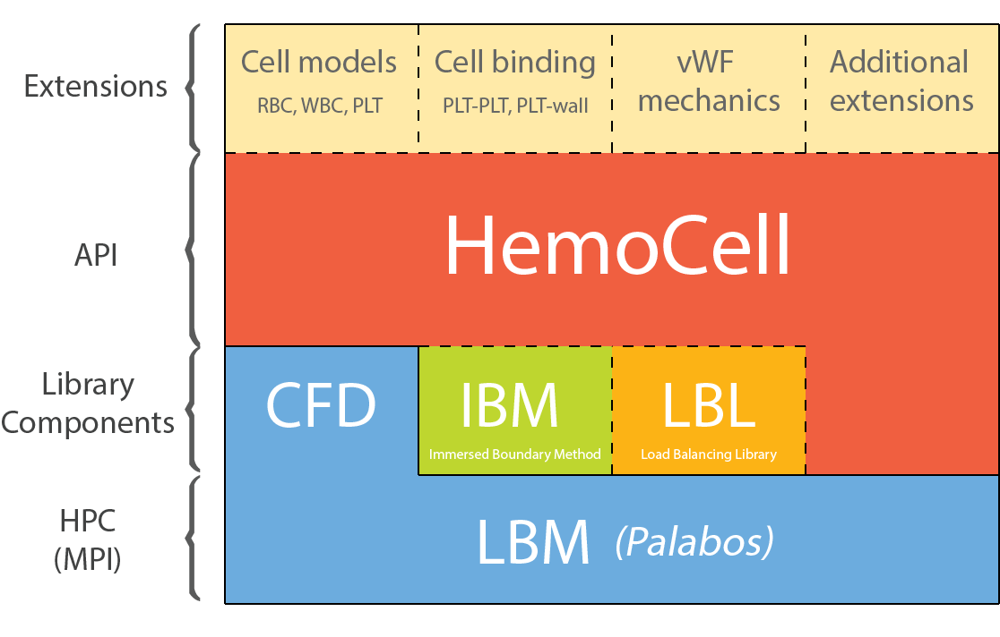

     _   _   ____   __  __   _____    ___   ____   __     __   
    ( )_( ) ( ___) (  \/  ) (  _  )  / __) ( ___) (  )   (  )  
     ) _ (   )__)   )    (   )(_)(  ( (__   )__)   )(__   )(__ 
    (_) (_) (____) (_/\/\_) (_____)  \___) (____) (____) (____)   
    
          HighpErformance MicrOscopic CELlular Library


About HemoCell
==========

`HemoCell` is a framework for simulating suspensions of deformable cells, focusing on blood. It is based of the combined Immersed boundary-lattice Boltzmann method (IB-LBM) and is currently built on top of the open source `C++` lattice Boltzmann solver [`Palabos`](http://www.palabos.org).

`HemoCell` has been developed as a framework:



A wide range of functions are provided on the API level to create the geometry, the type of flow, the type of cells (red blood cells, white blood cells, platelets, etc.), and the model which will be applied to them. It also provides a variety of actions: from applying forces to a certain number of surface particles to letting platelets stick to the walls or between each other. The already implemented cases serve as examples where the users can take the modules and build their own application from them.

Building Prerequisites
====================

`HemoCell` supports Linux, OS X, and Windows. It is currently requires a fairly recent GNU GCC compiler suite (> 5.1), and for distributed runs OpenMPI (> 1.4.5). CMake is used as the build automation tools.  The required packages are given for Debian based systems (such as Ubuntu), but they are available for OS X as well from [homebrew](http://brew.sh).

Installation of the required packages:

```bash
sudo apt-get install gcc g++ gdb make cmake
sudo apt-get install openmpi-bin openmpi-checkpoint openmpi-common libopenmpi-dev
sudo apt-get install h5utils hdf5-tools libhdf5-serial-dev
```

- On Windows 10, use the Linux subsystem feature (search for Ubuntu in Windows Store), then follow the above instructions to install the required packages.
- On Mac OS X install homebrew, and search for the packages providing the same tools (g++, openmpi, hdf5, cmake).

### Palabos
The working version of `Palabos` is bundled with HemoCell. Some modification of the source code is necessary for seamless and performant interoperation (see `Setting up the source` below). Other versions of Palabos are not currently supported.

### HDF5

`HemoCell` uses the `hdf5` library with the high-level extensions for the output and post-processing of the results. Debian packages `h5utils hdf5-tools libhdf5-serial-dev` are known to work for the I/O.

### Post-processing

Almost all the post-processing is performed by python scripts. The scripts are written for python 2.7, thus for newer versions some modifications might be needed. The necessary libraries are `numpy`, `matplotlib` and `h5py`. These are parts of most wide-spread python distributions (e.g., Anaconda, Canopy). Alternatively, you can install these on a Debian based system as follows:

```bash
sudo apt-get install python python-numpy python-matplotlib python-h5py
```


## Known issues
* Ordinary `Makefile`s do not work for IBM BG/Q systems. Instead use the `Makefile.cineca` as a template, found in the parent directory.
* Due to some changes required in the `Palabos` source code, patch files are provided for a custom version bundled together with HemoCell. Execute `setup.sh` before you start building the project (see below)


# Setting up the source

HemoCell currently depends on a modified version of Palabos which needs to be set up first. The required sources are bundled together with HemoCell, and a convenience script is provided to facilitate this process. Navigate to the main directory (e.g. /home/developer1/hemocell) and execute following script:

```bash
./setup.sh
```

Note: you only need to do this once, before any compilation!


Building instructions
================================

After HemoCell has been set up, issue the following from the folder of a case (e.g. hemocell/cases/pipeflow):

```shell
mkdir build
cd build
cmake ..
make
```

The CMake tries to make use of the installed libraries of the system instead of building them, thus you might also want to install development packages for Eigen and TinyXML.  Both HemoCell and Palabos are handled as an external library relative to the `case` in the CMake project structure.

Note: The CMake files are also suitable to use in IDE-s supporting CMake projects (e.g., CLion).

Documentation 
=============

- For a description of the material models and used techniques consult the open access [paper of HemoCell](http://journal.frontiersin.org/article/10.3389/fphys.2017.00563)
- Information about how to create initial conditions for the cells filed can be found in `${HEMOCELL}/doc/gen_random_pos.pdf`
- (deprecated, soon to be rewritten) Program documentation can be found in `${HEMOCELL}/doc/hemocell_UserGuide.pdf` which provides detailed information on the `HemoCell` configuration.

# FAQ

For frequently added questions refer to `FAQ.md` in the root directory of the project.

# License

HemoCell is currently available under a restrictive non-commercial license. Please see the file `LICENSE` in the root directory. 

Note that if HemoCell is used in any scientific project the license requires proper citation to be given! 


