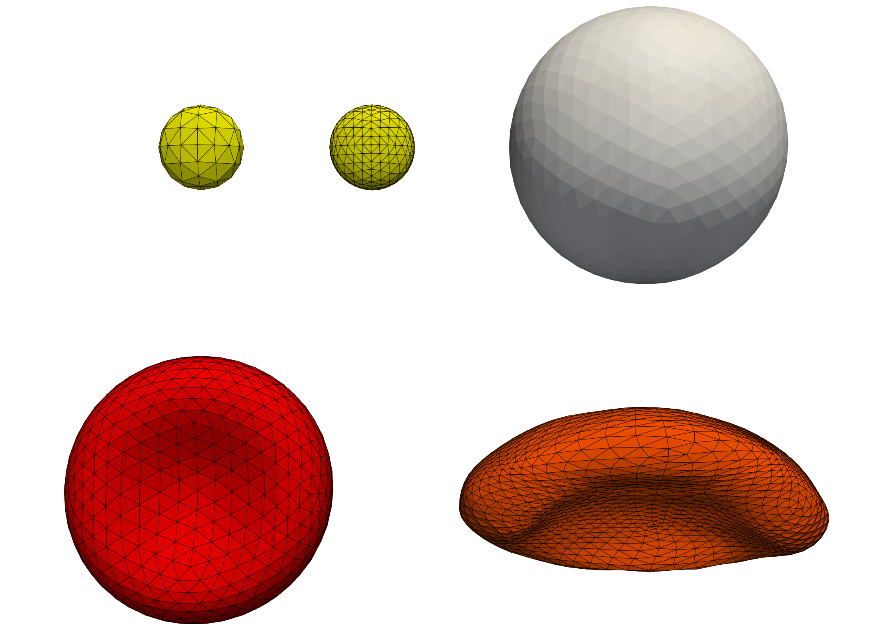

Custom cells and reading cells from STL
=======================================

HemoCell provides different cell types to be used in the simulations. Most
commonly, the red blood cells (RBCs) and platelets (PLTs) are used, often
together in the same simulation. However, for different use-cases, we support
changing the shapes and properties of these cells and even provide support for
directly loading in cell geometries from STL files.

Details on the various configuration settings can be found here:
:ref:`configuration<constants>`.

Specifying cell types
---------------------

Usually cells are generated mathematically, i.e. the vertex locations and the
resulting triangulation are gathered from describing equations. In these cases,
the equations describe the shape of the resulting cells, allowing for RBCs by
``RBC_FROM_SPHERE``, platelets by ``ELLIPSOID_FROM_SPHERE``, and WBCs by
``WBC_SPHERE``. These are then combined with a desired material model using the
``hemocell.addCellType<M>(name, S)`` with ``M`` a material model and ``S`` the
desired shape. For instance, typical RBCs are specified as

.. code-block:: c++

   hemocell.addCellType<RbcHighOrderModel>("RBC", RBC_FROM_SPHERE);

Reading cells from STL
----------------------

Alternatively, cells can be loaded from STL directly. In that case, we change
the desired shape argument ``S`` to ``MESH_FROM_STL`` indicating that we want to
read the shape from an STL file. The path to this file should be given in the
corresponding ``CELL.xml`` file, where ``CELL`` is to be replaced with the used
string identifier for the cell type. The path should be provided in the
``<hemocell><MaterialModel><StlFile>`` tag of the configuration file.

.. note::

   The specification of a custom shape can still be combined with typical
   material models, however, care has to be taken that this combination still
   makes sense physically. For more advanced use-cases, one might consider to
   implement a correpsonding material model as well.

.. note::

   The current STL reader only supports STL files written in ASCII format. Most
   software migth nowadays write STL using a binary format by default, so care
   should be taken to provide the STL file in ASCII format.

Cell shapes example
-------------------

The example in ``examples/cell_shapes`` presents a small overview of different
type of cell types embedded in a small cubic domain, where the main file,
``examples/cell_shapes/cell_shapes.cpp`` illustrates the initialisation of each
cell.

We consider four different cell types:

* Standard, *healthy* red blood cells

  .. code:: c++

     hemocell.addCellType<RbcHighOrderModel>("RBC_HO", RBC_FROM_SPHERE);

* Platelets using different levels of mesh refinement. The refinement level has
  been specific in ``PLT.xml`` using the
  ``<hemocell><materialModel><minNumTriangles>`` configuration parameter.

  .. code:: c++

     hemocell.addCellType<PltSimpleModel>("PLT", ELLIPSOID_FROM_SPHERE);
     hemocell.addCellType<PltSimpleModel>("PLT_HO", ELLIPSOID_FROM_SPHERE);

* White blood (spherical) cells

  .. code:: c++

     hemocell.addCellType<WbcHighOrderModel>("WBC_HO", WBC_SPHERE);

* Deformed red blood cells, read from STL. These load the geometry of the RBC
  directly from STL representing late-stage Malaria invested RBC models.

  .. code:: c++

     hemocell.addCellType<WbcHighOrderModel>("RBC_FROM_STL", MESH_FROM_STL);

   Illustration of different cell types supported in HemoCell. The yellow cells
   represent two platelets with a different number of minimum triangles used.
   The left discretisation uses less triangles, resulting in a less accurate but
   more performant surface representation. The white sphere corresponds to the
   white blood cell. The red cell to a healthy, "standard" shaped red blood
   cell. The orange cell corresponds to a cell geometry directly loaded through
   STL, representing a red blood cell to model a late-stage Malaria invested red
   blood cell.
