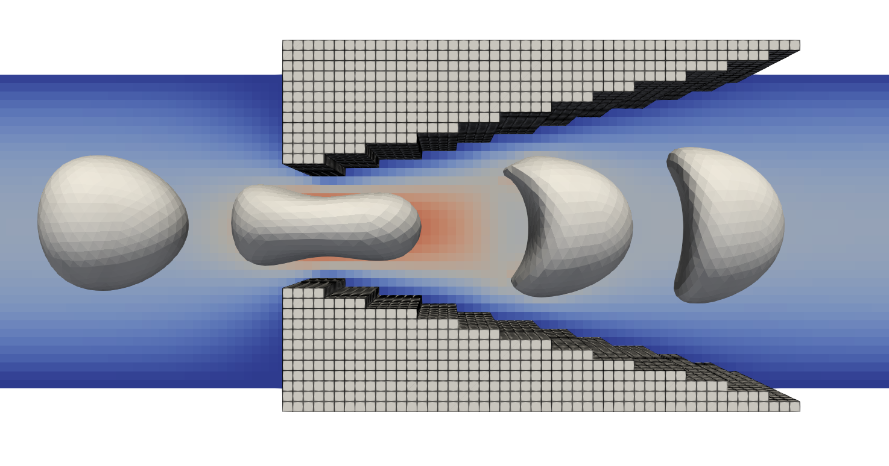
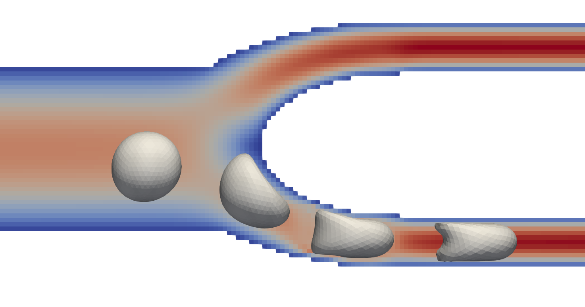

Capillary flow
==============

The example in ``examples/capillary`` presents two example cases where a single
white blood cell (WBC) is flowing through a narrow capillary. The considered
channels have smaller diameters compared to the WBC, requiring the cell to
undergo deformations as it squeezes through the channels.

Two variations are presented: a wedge-like geometry and a bifurcating channel,
with their details given in the subsequent sections. The code for both examples
is presented in a single main file ``examples/capillary/capillar.cpp`` where an
enumerated type ``Scenario`` is presented to toggle between both cases. To run a
specific example, you can modify the scenario definition at the top of the file
to match with the desired example case.

.. code-block:: c++

   const auto scenario = Scenario::Wedge
   const auto scenario = Scenario::Bifurcation

The specific code of each example is given in ``wedge.cpp`` and
``bifurcation.cpp`` for the ``Wedge`` and ``Bifurcation`` scenarios
respectively. After selecting a scenario, the compilation steps are identical to
other the example cases, see :ref:`compilation<compilation>`.

.. note::
   Both examples require that the white blood cell's solid core is smaller than
   the gaps between the solid domains, i.e. the gap between the wedges or the
   diameter of the bifurcating capillaries. This ensures that the WBC can
   undergo sufficient deformations to squeeze through the channels. The size of
   the solid core can be specified through the ``<MaterialModal><coreRadius>``
   parameter in the ``WBC_wedge.xml, WBC_bifurcation.xml`` configuration files.

Squeezing through a gap (``Scenario::Wedge``)
---------------------------------------------

The first example (``Scenario::Wedge``) considers a single white blood cell
(WBC) flowing through a narrow gap between two triangular wedges. Since the
outer diameter of the WBC is larger than the considered gap in the solid
geometry, the cell is compressed and squeezes through the gap. As the cell
passes through the gap, the distance to the solid regions increases and the cell
relaxes again. For reference material, please refer to Figure 3 of the
corresponding publication by `Lykov et al. (2017)
<https://doi.org/10.1371/journal.pcbi.1005726>`_.

   A white blood cell (WBC) as it flows through a wedge-like geometry. The cell
   is shown in four different configurations as it passes through the gap.
   Sinigificant deformations are observed that relax again once the cell has
   fully passed the smallest diameter of the gap. The shown velocity magnitude
   (blue to red) corresponds to the second deformation, i.e. when the cell
   passes through the smallest diameter.

A bifurcating capillary (``Scenario::Bifurcation``)
---------------------------------------------------

The second example (``Scenario::Bifurcation``) considers a single white blood cell
(WBC) flowing through one of two capillaries. The domain starts with a single
inlet that branches in two capillaries of equal length and cross-section.
Similar to the wedge-like geometry (``Scenario::Wedge``) the cell is smaller
than the diameter of the capillary, resulting in significant cell deformations.

   A white blood cell (WBC) as it passes into one of two identical capillaries
   past the bifurcation. The cell is show for four different configurations as
   it passes through the channel. Significat deformations are observed when the
   cell squeezed through the bottom capillary. The velocity magnitude is
   depicted (blue to red) for the second-last position of the WBC.

Adding repulsive forces
-----------------------

Both examples are evaluated without any repulsive forces between the cells and
the walls of the channel. To include repulsive forces, please refer to advanced
case regarding :ref:`repulsive forces <advanced_cases/repulsion:Repulsive
forces>`.
