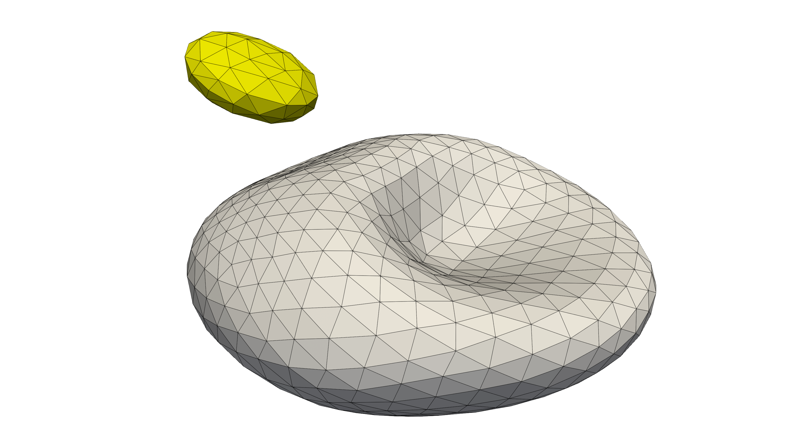
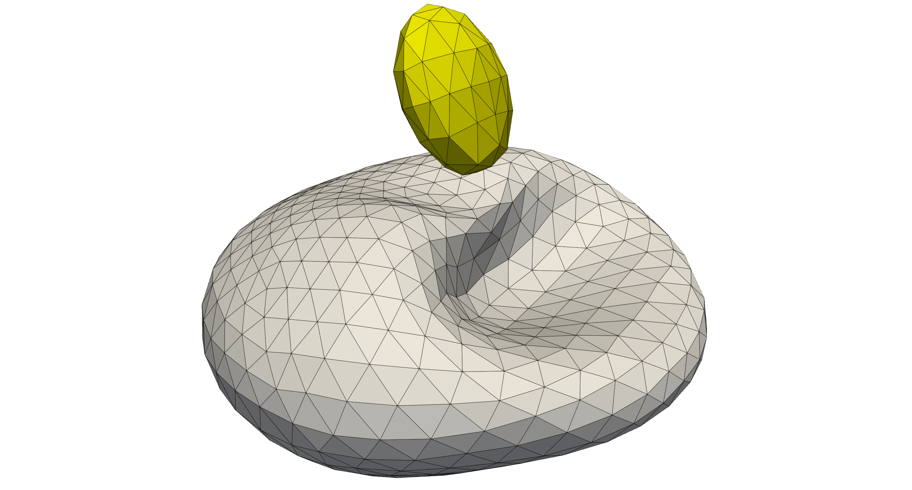
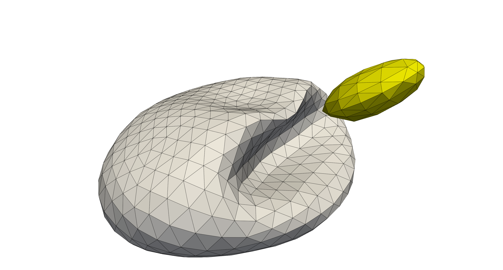
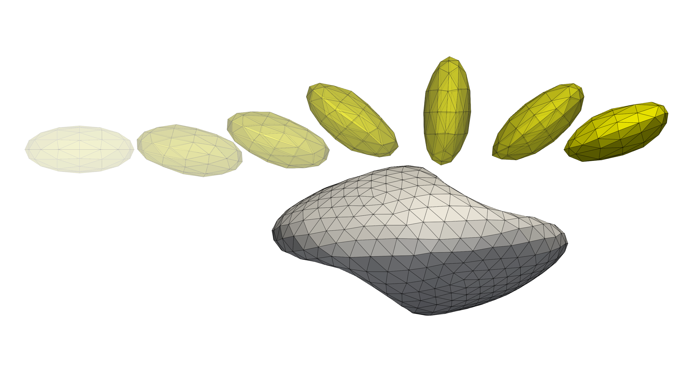

Colliding cells with interior viscosity
---------------------------------------

The example in ``examples/cellCollision_interior_viscosity`` illustrates a cell
collision between a red blood cell (RBC) and a platelet (PLT) embedded in a
shear flow. The problem also enables ``interior viscosity``, which was not
enabled in any of the previous examples. Furthermore, this example has been
showcased in the publication by Haan *et al.* [#IV]_.

After :ref:`compilation<compilation>`, the example can be run using single core as:

.. code::

   # run the simulation from `examples/cellCollision_interior_viscosity/`
   mpirun -n 1 ./cellCollision_interior_viscosity config.xml

   # generate Paraview compatible output files
   ../../scripts/batchPostProcess.sh

The outcome files are generated in ``tmp/``, where the flow field and particle
fields can be visualised separately by viewing the ``tmp/Fluid.*.xmf``,
``tmp/RBC.*.xmf``, and ``tmp/PLT.*.xmf`` files in `Paraview`_.

In the presented example, the following initial cell positions are considered
for the platelet and the red blood cell, see
:ref:`initial cell positions <cases/cellCollision_interior_viscosity:initial cell positioning>`
for a brief description on these input positions.

* The platelet

  .. code::

     # PLT.pos
     1
     14.5 13.0 9.0 90 0 0

* The red blood cell

  .. code::

     # RBC.pos
     1
     5.5 13.0 7.0 90.0 0.0 0.0

The following RBC-PLT interaction is observed, where the PLT passes besides the
RBC and clearly showing the interaction between both cells. Note, both cells are
immersed within a shear flow, so there is the tendency for the cells to rotate
around their own axis. To ensure the (near) collision occurs, the platelet is
slightly offset in the shear flow, such that a larger horizontal velocity is
achieved.

   The PLT approaching the RBC in the shear flow.

   The PLT passing around the RBC in the shear flow where the interaction
   between both cells is clearly visible by the deformations at the topside of
   the RBC.

   The PLT downstream of the RBC in the shear flow. The effect of the (near)
   collision is still visible in the current deformations of the RBC.

To visualise the path of the platelet, we aggregate various
time steps together making it clear how the platelet approaches and moves past
the RBC.

   The trajectory of the PLT as it passes and interacts with the RBC in the
   shear flow. The previous positions of the platelet are illustrated with
   slight opacity.

Initial cell positioning
========================

The initial cell positions are given through ``*.pos`` files in ``HemoCell``.
The RBC and PLT cells are respectively given in ``RBC.pos`` and ``PLT.pos``.
These files hold the initial position in ``x, y, z`` coordinates and the three
rotations around the corresponding axis. The initial conditions can be modified
to observe different collision interactions between both cells.

The files start with a header indicating the number of cells present in the
file, followed by a position and rotation for each file in the subsequent lines,
e.g.

.. code::

   # RBC.pos
   1
   5.5 13.0 7.0 90.0 0.0 0.0

Configuration
=============

In addition to the RBC and PLT positions, there are three main configuration
parameters to consider in this example:

* ``<domain><shearrate>``: this controls the shear rate int he domain and is
  presented uniformly by specifying velocity boundary conditions on the top and
  bottom boundaries of the domain.

* ``<sim><interiorViscosity>``: the interval at which the interior and exterior
  fluid cells are determined near the boundary of the cells. If the cells move a
  lot, this can lead to the interior viscosity *leaking* to the outside of the
  domain. However, it should be noted that this behaviour has not been observed.

  .. note::
     Note, the performance impact is low and the set interval can be kept small.

* ``<sim><interiorViscosityEntireGrid>``: the interval at which the interior and
  exterior fluid of every cell is computed *exactly* using ray tracing.

  .. note::
     Note, this is extremely expensive and short intervals should be avoided.

Publication cases
=================

To generate the cases presented in [#IV]_ the ``Generate`` folder provides
additional details, especially in the provided ``Generate/README``. In this
directory additional scripts are found to generate a variety of initial
conditions for the RBC and PLT and additional runner scripts.

.. _Paraview: https://www.paraview.org/
.. _gnuplot: http://www.gnuplot.info/
.. [#IV] `Numerical Investigation of the Effects of Red Blood Cell Cytoplasmic
   Viscosity Contrasts on Single Cell and Bulk Transport Behaviour.  Applied
   Sciences 8. <https://doi.org/10.3390/app8091616>`_ M de Haan, G Zavodszky, V
   Azizi, A Hoekstra.
