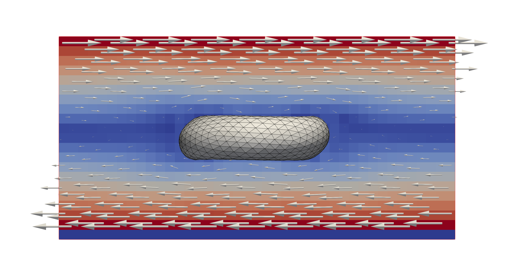
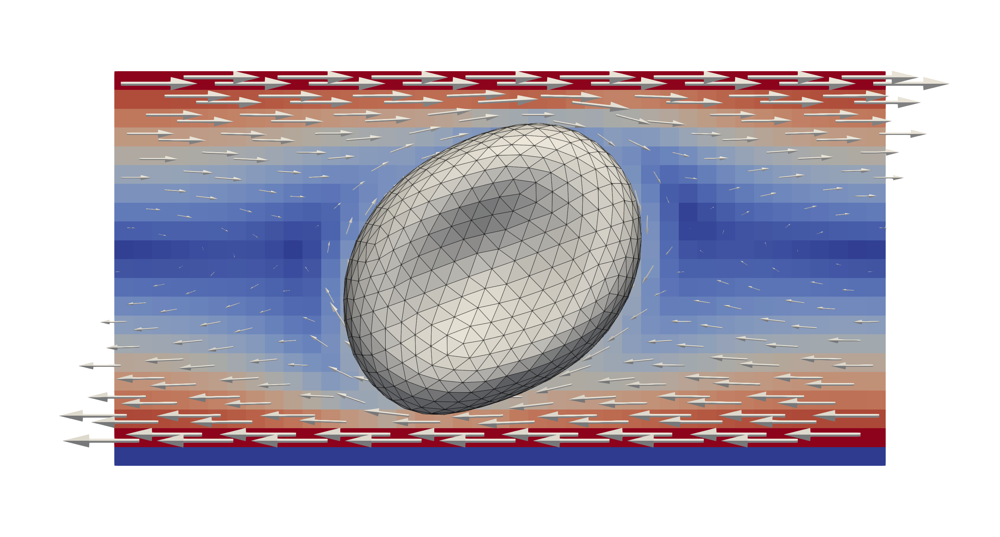

One shearing cell
-----------------

The example in ``examples/oneCellShear`` presents a single red blood cell
(RBC) subjected to a shearing flow. The example provides a validation case for
the different material models used in ``HemoCell``.

A single RBC is initialised in a fully periodic domain, i.e. periodicity is
enabled for all boundaries. The domain is then subjected to a shearing flow in
the ``x``-direction. To achieve this flow field, the top and bottom surfaces are
subjected to velocity boundary conditions in opposing directions. The largest
diameter achieved by the RBC is reported and can be compared with respect to
experimental data.

After :ref:`compilation<compilation>`, the example can be run using single core as:

.. code::

   # run the simulation from the `examples/oneCellShear` directory
   mpirun -n 1 ./oneCellShear config.xml

   # generate Paraview compatible output files
   ../../scripts/batchPostProcess.sh

The outcome files are generated in ``tmp/``, where the flow field and particle
fields can be visualised separately by respectively viewing the
``tmp/Fluid.*.xmf`` and ``tmp/RBC.*.xmf`` files.

   A single red blood cell subjected to a shearing flow in ``x``-direction. The
   colours and glyps indicate the flow velocity and direction. The effect of the
   shearing flow becomes visible in the deformations of the RBC.

A `gnuplot`_ script is provided as well to visualise the largest diameter of the
cell over the iterations, which can be invoked through

.. code::

   gnuplot shear.gpl

Tank treading
=============

A simple variation of the single shearing RBC, is to consider the "tank
treading" case. This considers a problem where the RBC is rotated in the domain
and can be achieved by changing the loaded RBC properties by updating ``"RBC"``
used in the ``oneCellShear.cpp`` example to ``"RBC_tt"``.

   A single red blood cell subjected to a shearing flow in ``x``-direction in
   the "tank treading" configuration. The colours and glyps indicate the flow
   velocity and direction. The cell now "rotates" along with the shearing flow
   resulting in different deformations.

Configuration
=============

The imposed velocity is derived from the shear rate provided in the configuration
file ``config.xml``, where the shear rate can be set manually by updating the
``<domain><shearrate>`` entry. Note, this value specifies the shear rate in
``1/s``.

Rendering
=========

An example rendering pipeline with Blender is illustrated in the
``hemocell/scripts/visualization/render_oneCellShear.py`` script, for more
information see :ref:`Rendering with Blender<visualization:Blender>`.

   An example rendering of the RBC using Blender.

.. _gnuplot: http://www.gnuplot.info/
