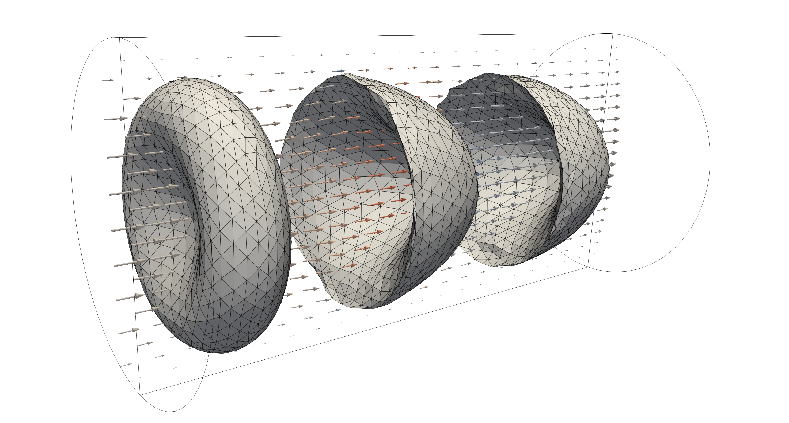
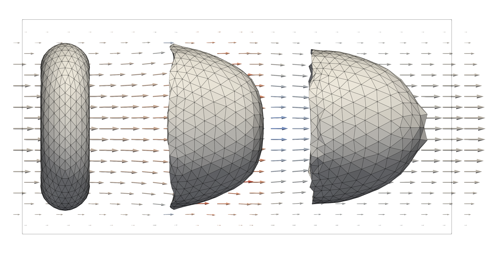

A parachuting cell
------------------

The example in ``examples/parachuting`` presents a example cases where a single
red blood cell (RBC) is flowing, or "parachuting", through a narrow pipe. The
domain is obtained by voxelisation of a surface mesh of a tube given in STL
format (``tube.stl``). After discretising the domain, the boundary conditions
are applied to mimic an endless pipe flow by prescribing periodic conditions at
either end. The flow is driven by an external force to achieve the desired,
equivalent Poiseuille flow through the pipe. So, although only a small section
of pipe is modelled, the RBC is flowing through an endless pipe.

After :ref:`compilation<compilation>`, the example can be run using single core,
or multiple cores, as:

.. code::

   # run the simulation from the `examples/parachuting` direc
   mpirun -n 1 ./parachuting config.xml

   # generate Paraview compatible output files
   ../../scripts/batchPostProcess.sh

The output files are generated in ``tmp/``, where the flow field and particle
fields can be visualised separately by viewing the ``tmp/Fluid.*.xmf`` and
``tmp/RBC.*.xmf`` files in `Paraview`_.

The RBC will be transported and deformed due to the available flow profile in
the pipe. This results in the typical deformation profile of the RBC within the
pipe flow, giving rise to the "parachuting" name.

   Three different stages of the RBC embedded in the pipe flow. The left-most
   figure shows the initial condition of the RBC, where the right-most
   illustrates the final steady-state configuration of the RBC after the initial
   deformations in the Poiseuille flow. The glyphs illustrate the velocity
   field corresponding to the middle snapshot of the RBC.

   A side view of the previous figure illustrating more clearly the
   crosssectional profile of the RBC at the three different stages. Again the
   glyphs illustrate the velocity field corresponding to the middle
   configuration of the RBC.

Configuration
=============

The problem can be configured by changing values in the ``config.xml`` file, for
instance to change the number of output iterations by ``<sim><tmeas>``, the
Reynolds number ``<domain><Re>``, or the discretisation size of the domain
``<domain><refDirN>``.

.. _Paraview: https://www.paraview.org/
