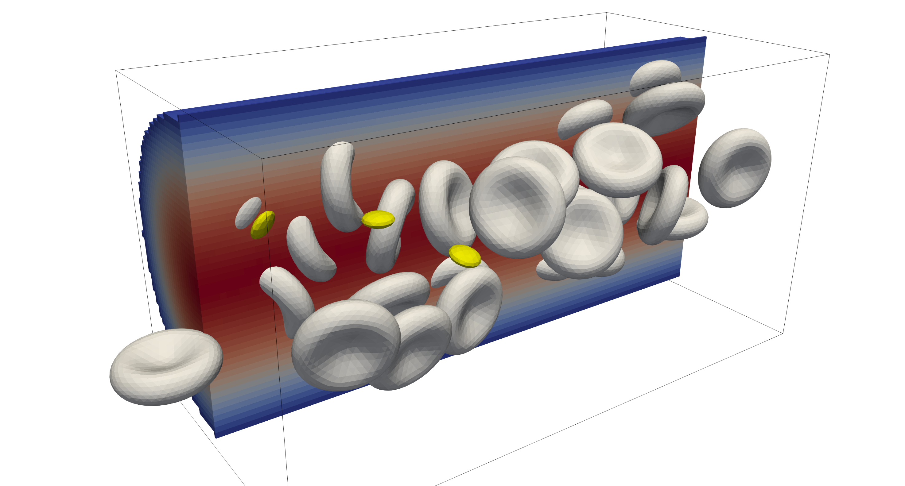
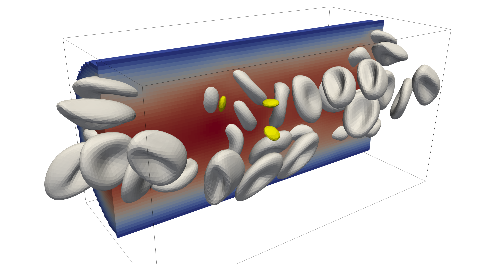

Pipe flow
---------

The example in ``examples/pipeflow/`` presents a generic pipe flow scenario that
can be the basis for many other projects. The domain considers a single tube,
given in ``tube.stl``, with periodicity along the length of the tube, i.e. an
endless pipe flow configuration.

The STL file is first voxelised to obtain a discretisation of the pipe domain,
after which the periodic boundary conditions are applied. The domain is subjected
to an equivalent external forcing to obtain a desired Poiseuille flow throughout
the domain.

The examples considers both red blood cells (RBCs) and platelets (PLTs) of which
the initial positions are given in ``RBC.pos`` and ``PLT.pos``. To generate
alternative initial positions, e.g. using different hematocrit or RBC to PLT
ratios, see :ref:`cases/pipeflow:Cell packing` or the :ref:`packCells <packcells>` tool.

After :ref:`compilation<compilation>`, the example can be run as:

.. code::

   # run the simulation from the `examples/pipeflow` directory
   mpirun -n 1 ./pipeflow config.xml

   # generate Paraview compatible output files
   ../../scripts/batchPostProcess.sh

   The initial condition of the pipeflow example. The image illustrates the
   bounding domain in the black outline, where a cross-section of the fluid
   field is shown in the solid colors with the initial positions of the red
   blood cells and platelets (in yellow).

After running for a number of iterations, we can observe the displacements and
deformations of the RBCs as the move through the pipe and interact with the
available platelets. Note that both the fluid field as well as the particle
field show full periodicity along the length of the pipe.

   The updated cell positions after various iterations where the displacement
   and deformations of the particles become visible. In this example a Reynolds
   number of ``0.2`` was used.

To change diameter the of the pipe and the initial cell positions, see
:ref:`cases/pipeflow:Configuration`.

Configuration
=============

The configuration of the problem is provided in ``config.xml``, where the flow
direction through the tube (``tube.stl``) is assumed aligned with the
``x``-axis. There are three parameters of specific interest for this example

- ``<domain><refDirN>``: this controls the number of fluid cells perpendicular
  to the flow direction. Thus, this parameter directly controls the diamter of
  the pipe, as a single fluid cell translates to 0.5µm.

  .. note::

     When you change the dimensions of the pipe, you might want to update
     the cell positions accordingly or generate new positions all together, see
     :ref:`cases/pipeflow:Cell packing`.

- ``<domain><Re>``: the Reynolds force from which the driving for is calculate
  for the periodic flow through the pipe.

  .. note::

     The Reynolds number corresponds to the one that would be found when
     the system is evaluated without any cells present. Thus, the observed
     velocities might be lower than expected when cells are present in the
     system. For too larger Reynold numbers, the simulation might become
     unstable.

- ``<domain><geometry>``: the STL file used for the discretisation, where
  ``tube.stl`` has been used throughout this example. Other STL files might be
  used, although care should be taken in modifying the periodic boundary
  conditions when the inlets of the pipe are changed with respect to the
  configuration in ``tube.stl``.

Cell packing
============

The default ``RBC.pos`` and ``PLT.pos`` files contain many positions for the red
blood cells and platelets. The number of particles, their positions, and the
ratio between RBC and PLT have all been generated by the
:ref:`packCells<packCells>` tool. For instance, when increasing the size of the
pipe, more RBCs and PLTs will fit inside the domain, so you might want to
regenerate the initial positions accordingly to populate the pipe with a desired
number of particles at the start of the iterations.
