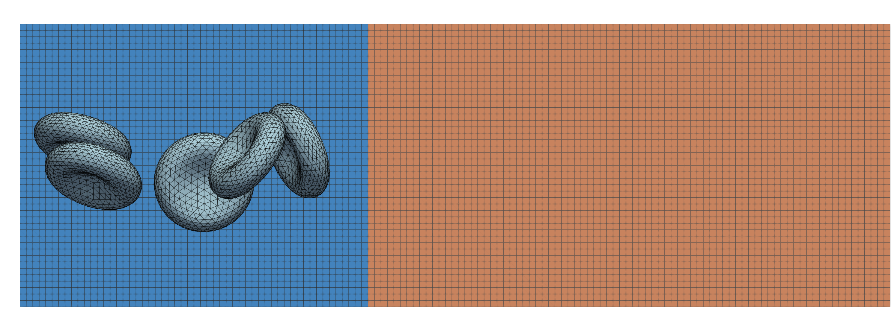
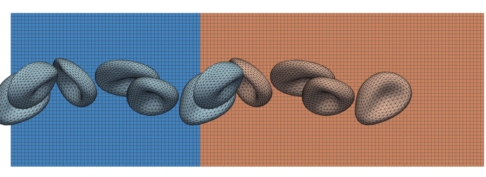
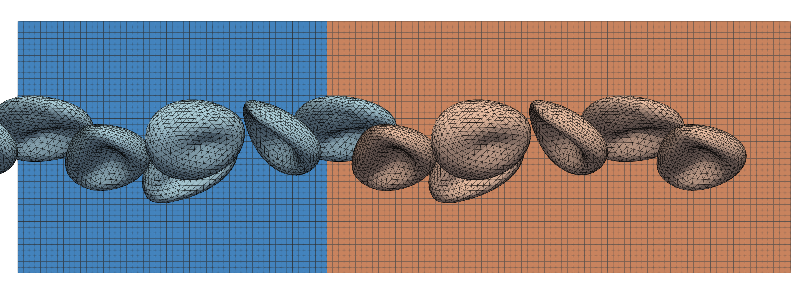

Pipe flow with periodic inflow
------------------------------

The example in ``examples/pipeflow_with_preinlet`` provides an extension of the
:ref:`pipe flow <cases/pipeflow:Pipe flow>` example with the advanced
``pre-inlet`` boundary condition as discussed in the next section.

After :ref:`compilation<compilation>`, the example can be run as:

.. code::

   # run the simulation from the `examples/pipeflow_with_preinlet` directory
   mpirun -n 1 ./pipeflow_with_preinlet config.xml

   # generate Paraview compatible output files
   ../../scripts/batchPostProcess.sh

Pre-inlet boundary condition
============================

The pre-inlet is one of the advanced boundary conditions in HemoCell and
it provides a mean to generate a periodic influx of particles into the main
simulation domain. This is of specific interest when normal periodicity on the
original simulation domain is not adequate. For instance, consider the
following scenario:

- A complex simulation domain might have a large fluid area that slowly fills up
  with particles as the simulation progresses. To simulate such behaviour, we
  would like to introduce a continuous flow of particles into the simulation
  domain, without initially packing the full domain with particles. In such a
  scenario, the pre-inlet will provide a continuous, periodic influx of
  particles from a small section of packed domain.

- A simulation domain might not have matching inlet and outlets to specify
  periodic conditions, e.g. when the inlet and outlet have different
  non-matching diameters. In this case, the pre-inlet can be used to provide a
  constant influx of particles at the inlet, where the particles reaching the outlet
  are removed from the simulation.

The pipe flow scenario using the pre-inlet is visualised in the following
sequence of images. The total domain contains two regions: the pre-inlet (blue,
left) and the main simulation domain (orange, right). At first, the particles,
in this case red blood cells, are initialised in the pre-inlet domain.

   A two-dimensional projection of the total domain consisting of the periodic pre-inlet
   (blue, left) and the non-periodic main simulation domain (orange, right). The pre-inlet
   domain is seeded with a number of red blood cells at the start of the
   simulation.

As the simulation progresses, the RBCs in the pre-inlet approach the main
simulation domain. At this moment in time, these RBCs are *copied* into the main
simulation domain as well as repeated again at the *inlet* of the pre-inlet.
Notice how the RBCs near the boundary change from blue (pre-inlet) to orange (main
domain) as they cross this boundary. Additionally, you can see the cells near
the boundary reappear at the pre-inlet's inlet.

   After a number of iterations the pre-inlet starts to provide the main
   simulation domain with a periodic influx of red blood cells. As these cells
   cross the boundary between both domains a *copy* is transferred to the main
   simulation domain and the cells is repeated at the pre-inlet's inlet. Notice
   how the cells crossing this border go from blue to orange. Additionally, you
   can see the cells *at* this boundary repeated at the pre-inlet's inlet.

After numerous iterations the pre-inlet will achieve a quasi-steady-state,
providing a continuous stream of particles to the main simulation domain.

.. note::

   The distribution of these particles originate from the original positioning
   of particles within the pre-inlet. Thus, to achieve a larger number of
   particles flowing into the main simulation domain, the pre-inlet should be
   packed more densely at the start (see :ref:`packCells<packCells>`).

   After more iterations the pre-inlet keeps seeding the main simulation domain
   with new particles, all originating from a single initial positioning.

Conceptually, the pre-inlet works as follows: the pre-inlet is attached to an
original inlet of a simulation domain of interest. The pre-inlet is then
subjected to periodic boundary conditions on *its* inlet and outlet surface. At
the start, we seed the pre-inlet with a specific arrangement of particles (red
blood cells, platelets, etc) as generated by :ref:`packCells<packcells>`.

During simulation, the particles will flow through the pre-inlet and cross the
interface between the pre-inlet and the main simulation domain. At that moment,
the specific particle is *copied* to the main domain as well as to the inlet of
the pre-inlet (due to its periodic boundaries). This ensures that the original
packing of the pre-inlet remains (approximately) constant as the simulation is
ongoing, while simultaneously introducing new particles into the simulation
domain.

.. note::

   Although the original cell positioning can be purely aimed at populating the
   pre-inlet region of the domain, there is of course no limitation to pack the
   full domain. In that case, the cells that are present in the pre-inlet at
   initialisation will be subjected to the periodic behaviour of the pre-inlet
   and are continuously introduced into the main simulation domain. The other
   particles, i.e. the ones in the main domain, are not effected by the presence
   of the pre-inlet.

Configuration
=============

For basic configuration of the pipe flow, this example follows the same
configuration settings as the original :ref:`pipe flow <cases/pipeflow:Pipe
flow>` example, as discussed :ref:`here <cases/pipeflow:Configuration>`.
However, there are some pre-inlet specific parameters that can be modified:

- ``<preInlet><parameters><lengthN>``: the length of the pre-inlet in lattice
  units. This indicates the length of the pre-inlet that is inserted before the
  main domain.

.. note::

   Compared to the original :ref:`pipe flow <cases/pipeflow:Pipe flow>` example,
   the packing is now aimed at the pre-inlet region of the domain. This might
   require to shift the original placements of the cells accordingly.
