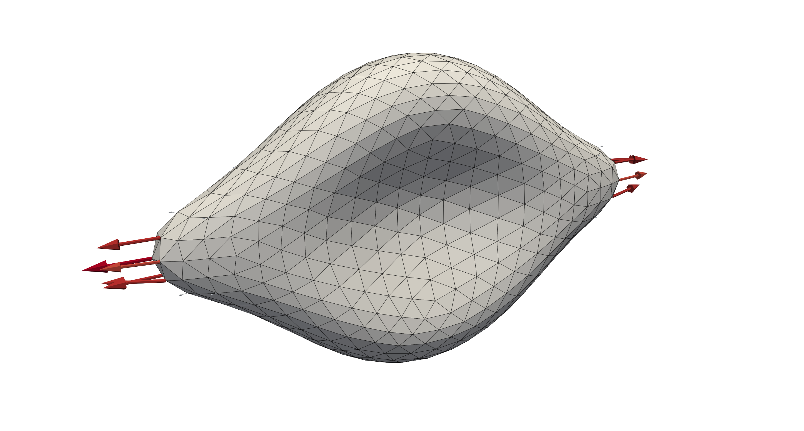

One stretching cell
-------------------

The example in ``examples/stretchCell`` presents a validation example for the
material models used in ``HemoCell``. A single cell is initialised in a
periodic domain, i.e. all external surfaces are subjected to periodic boundary
conditions.

A pair of external forces are applied on the outer points of the cell pointing
in opposite directions. These forces *stretch* the cell, where its deformation
can be validated with respect to experimental data.

After :ref:`compilation<compilation>`, the example can be run using single core as:

.. code::

   # run the simulation from the `examples/stretchCell/`
   mpirun -n 1 ./stretchCell config.xml

   # generate Paraview compatible output files
   ../../scripts/batchPostProcess.sh

.. note::
   The stretching cell examples should be run with just a single processor, so
   either ``mpirun -n 1 ./stretchCell config.xml`` as above, or directly
   ``./stretchCell config.xml``, as the helper function to stretch the cell only
   supports sequential operation.

The outcome files are generated in ``tmp/``, where the flow field and particle
fields can be visualised separately by viewing the ``tmp/Fluid.*.xmf`` and
``tmp/RBC.*.xmf`` files in `Paraview`_.

   A deformed red blood cell after being subjected to opposing forces at either
   side of the RBC, where the arrows visualise the applied forcing.

A `gnuplot`_ script is provided as well to directly visualise the ratio between
the volume and surface deformations.

.. code::

   gnuplot stretch37.gpl

Configuration
=============

There are two main parameters that can be modified in this example, i.e. the
applied stretching force in pico Newton and the location where the force is
applied to.

* ``<parameters><prctForced>``: the percentage of nodes of the RBC where the
  external force is applied to. The value can range from ``0`` to ``1`` where
  ``0`` indicates no forcing and ``1`` applies the force to all nodes on each
  half of the RBC.

* ``<parameters><stretchForce>``: the applied stretching force in pico Newton.

.. _Paraview: https://www.paraview.org/
.. _gnuplot: http://www.gnuplot.info/
